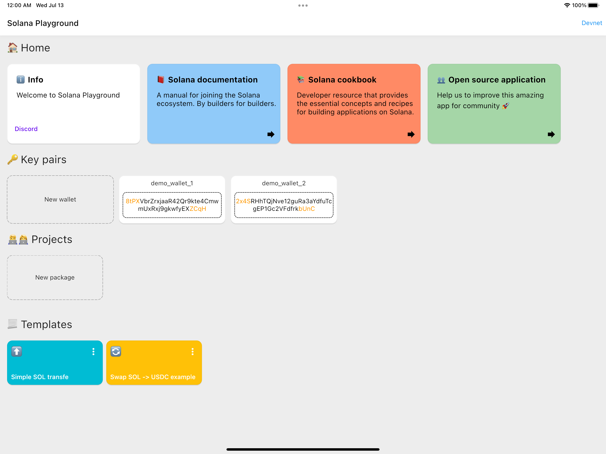
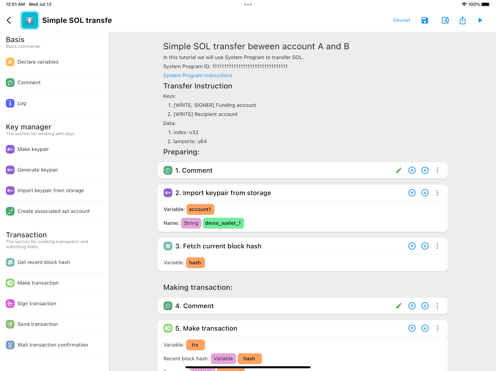
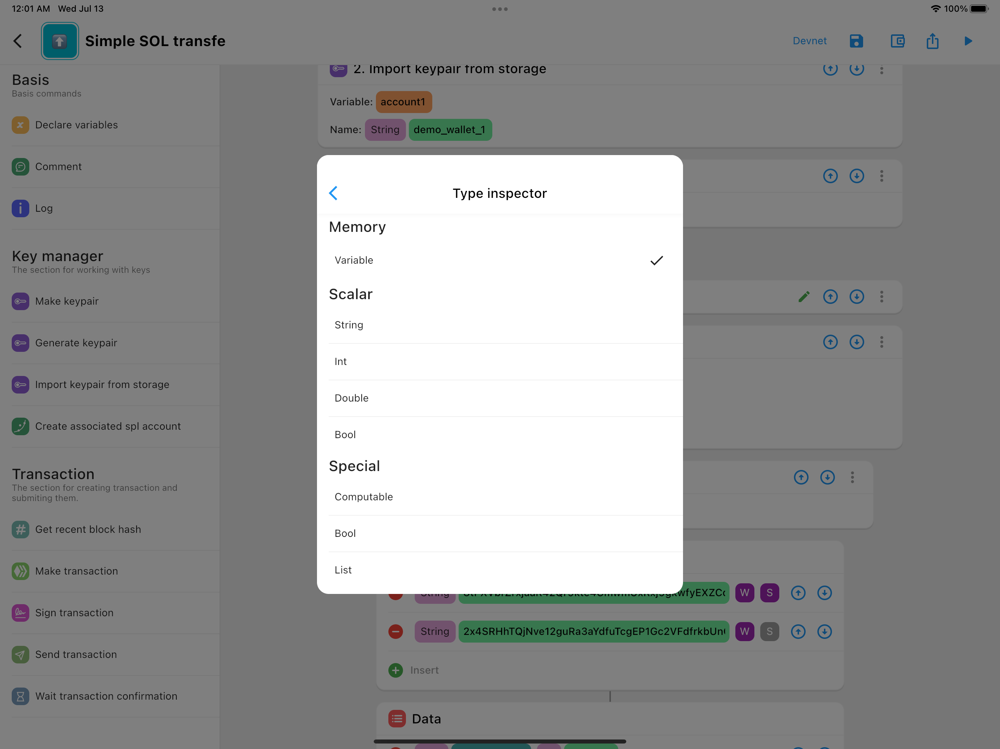
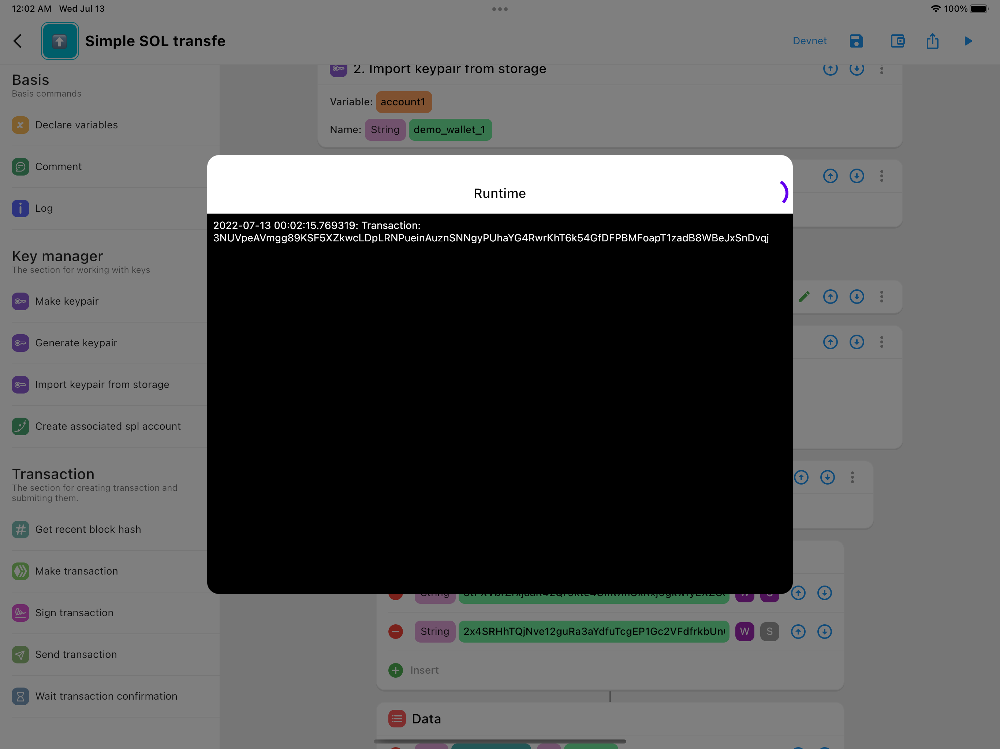

# Solana Playground

Solana Playground offers super-easy way for users to interact with the blockchain system by allowing them to fully customise Solana transactions according to their unique needs. The app is compatible with iOS, Android, MacOS, Windows and Web platforms using Flutter. Solana Playground is for everybody, even those with no prior knowledge in writing computer programs and helps them better understand how blockchain works. Meanwhile it also welcomes experienced developers who want to quickly sketch and test their ideas with blockchain. Other dex platforms can also use Solana Playground as a place to demonstrate their features. Solana Playground should be a place where people play with Solana Blockchain.

## Requirements

1. Flutter
2. Dart

## How to run

Type `flutter run --release` and then choose a device that will run the application

## Status

- Beta version

## Features
- [x] Create project
- [x] Customize script
- [x] Run script

## Links
- Presentation: https://www.icloud.com/keynote/0d6-9dqJNbtD5H1SpvjGKMseQ#Solana_Playground_presentation_share

## Screenshots

