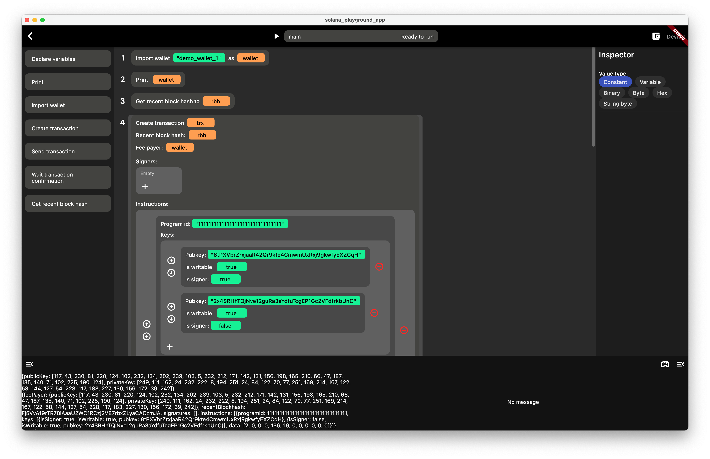
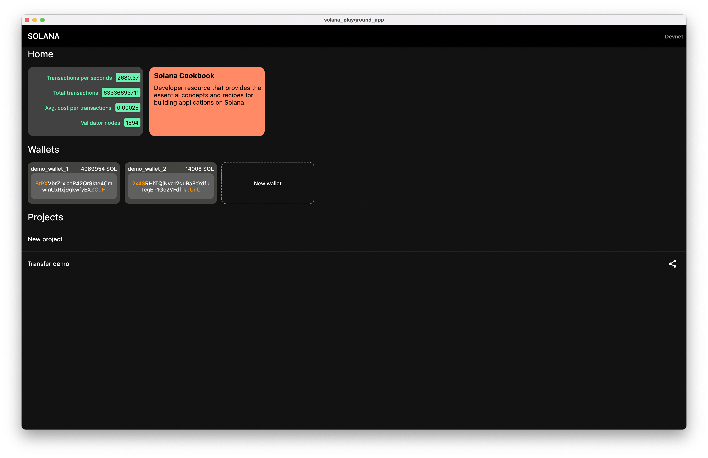

# solana_playground_app

The app that helps people to easily create transaction on iOS, Android, MacOS, Windows and Web.

## Requirements

1. Flutter
2. Dart

## How to run

Type `flutter run --release` and then choose a device that will run the application

## Features
- [x] Create project
- [x] Customize script
- [x] Run script
- [x] Export the script
- [ ] Share script
- [ ] Network fetching
- [ ] Instruction template

## Screenshots

